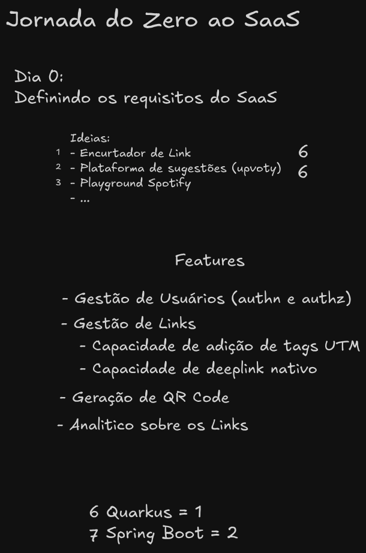

# 🔗 buildrun-encurtador-link-fbr

SaaS de Encurtador de Links desenvolvido pela comunidade [Build & Run](https://github.com/buildrun-tech), projeto destina aos alunos para desenvolver habilidades da equipe e demostrar a construção de um software do zero desde os desenhos de concepção de arquitetura até a implementação
Este projeto fornece uma aplicação robusta para encurtamento de URLs, com gerenciamento e análise dos links criados.

## 🚀 Tecnologias Utilizadas

- **Java**
- **Spring Boot**
- **MongoDB**
- **AWS**
- **Docker**

## 📦 Estrutura do Projeto

tech-encurtador-link-/
├── app/ # Código-fonte da aplicação
├── diagrama.drawio # Diagrama da arquitetura
├── encurtador-fbr.png # Imagem ilustrativa da aplicação
├── README.md # Documentação do projeto
└── .gitignore # Arquivos ignorados pelo Git

## 🛠️ Funcionalidades

- Encurtamento de URLs longas.
- Redirecionamento automático.
- Interface para gerenciamento dos links.
- Estatísticas de uso (cliques).
- Integração com AWS para escalabilidade.

## 📷 Imagem da Aplicação




## 🧪 Como Executar o Projeto

### 1. Clone o repositório:

```bash
git clone https://github.com/alexandrealvees/tron-encurtador-link
cd tron-encurtador-link
```

### 2. Configure variáveis de ambiente:

Crie um arquivo `.env` ou defina as variáveis diretamente no ambiente, conforme necessidade da aplicação (MongoDB, AWS, etc).

### 3. Execute a aplicação localmente:

```maven
./mvnw spring-boot:run
```

Acesse em: [http://localhost:8080](http://localhost:8080)

## 🤝 Contribuindo

Contribuições são bem-vindas!
Abra uma issue ou envie um pull request com sugestões e melhorias.

## 📄 Licença

Este projeto está sob a Licença MIT.
Consulte o arquivo LICENSE para mais detalhes.
